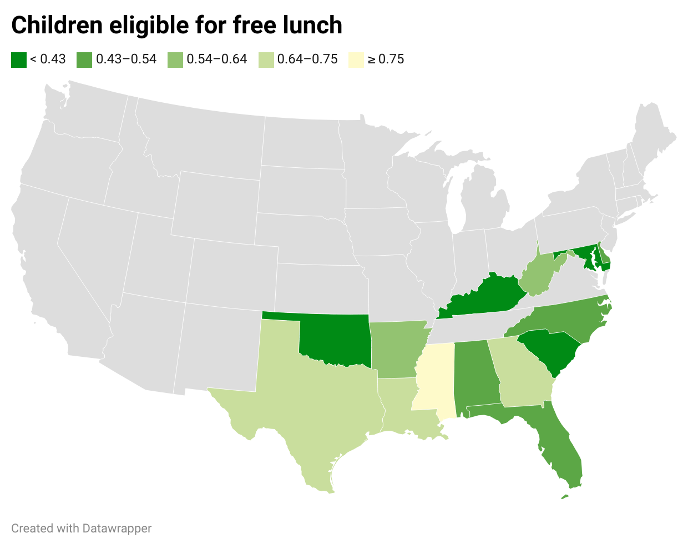
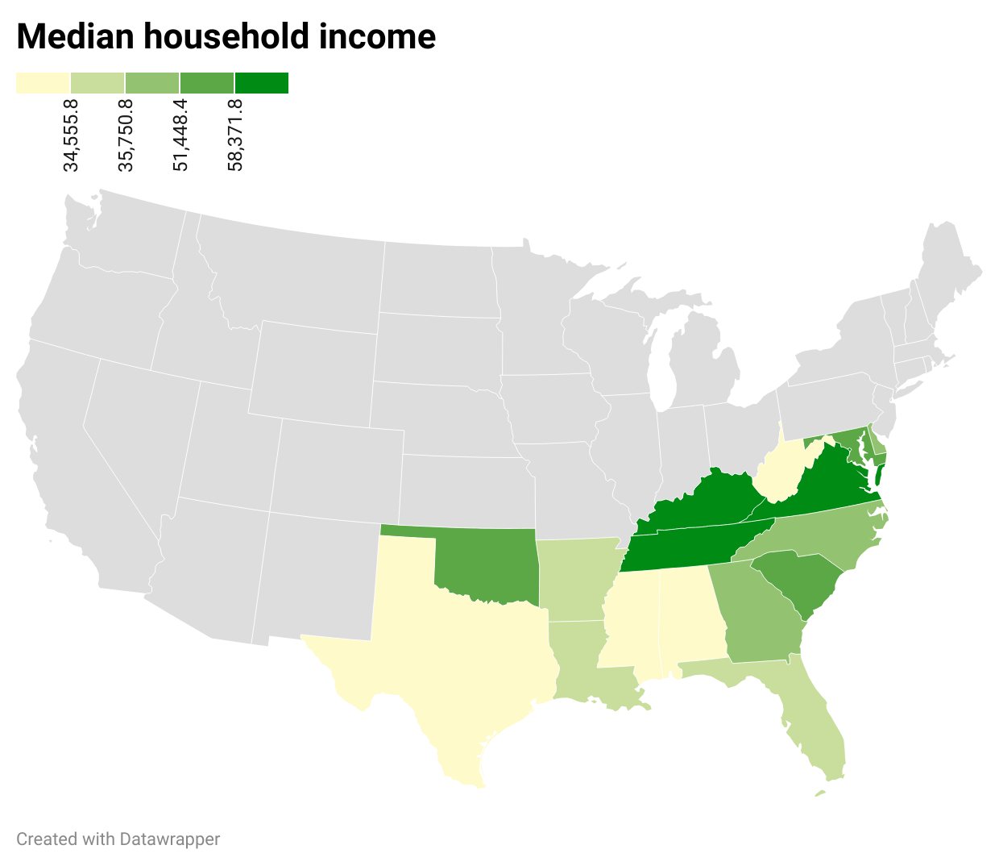
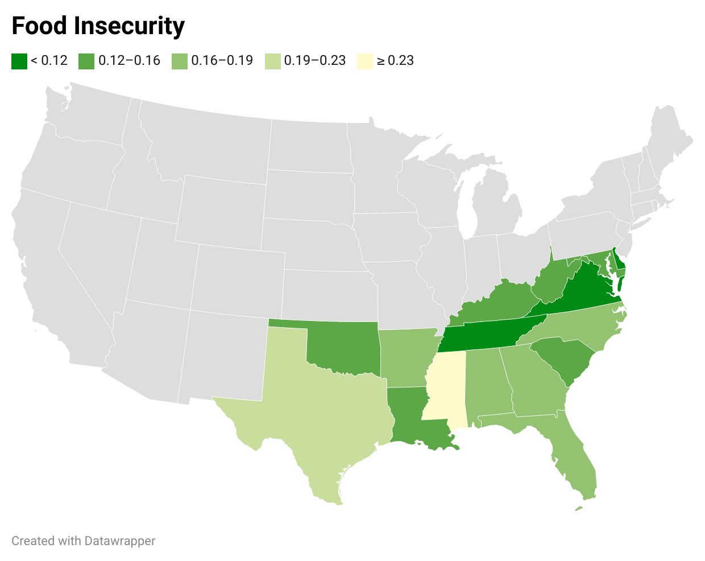

# Food insecurity within the Southern US 
- This respoitory contains the instructions and contents used to explore the correlation between food insecurity and the average family income within the Southern states of the US
- To get started, download the linked Phyton notebook and follow along 
# Content and Source
- Orginal CountyHealthData_2014-2015.csv
- Phyton notebook, detailing the steps to create a subset of data
- New .csv file of the created subset
- 3 data visualizations using subset
# Possible Usage
- Indviduals wishing to educate theirselves on the snowball effect of food insecurity  
- This data could also be used to develop plans to correct food scarcity 
# Data Visualizations

